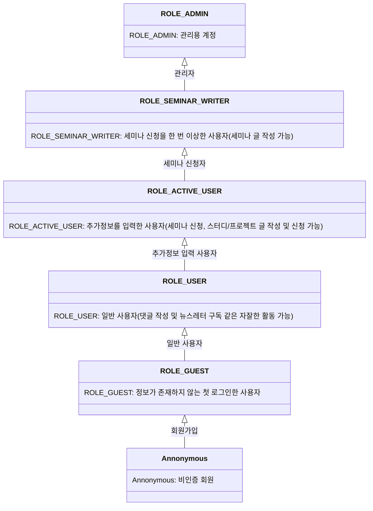

#  🏫 Kumoh-Talk

> 국립금오공과대학교 학생들의 교내 IT 교류를 위한 커뮤니티 및 온라인 세미나 플랫폼

## 📖 프로젝트 소개

### 개요

Kumoh-Talk는 교내에서 학습한 기술과 지식을 나누기 위한 IT 기술 블로그 서비스입니다.  
학교 내 학생들 간의 지식 공유가 부족하고 소극적인 분위기를 개선하고자, 자유롭게 공부한 내용을 공유할 수 있는 공간을 만들기 위해 시작되었습니다.  
오프라인 시범 운영 후, IT 학생이 참여하는 행사로 성장했으며, 이를 온라인에서도 지속할 수 있도록 기술 블로그를 개발하게 되었습니다.

[Kumoh-Talk 5W1H 기획안](https://github.com/Kumoh-talk/kumoh-talk-Frontend/wiki/%ED%94%84%EB%A1%9C%EC%A0%9D%ED%8A%B8-%EC%84%A4%EB%AA%85)

[Kumoh-Talk 유튜브](https://www.youtube.com/@midnight_kumoh_talk)
#### 핵심 기능 요약
- **모집글 작성**: 스터디/프로젝트/멘토링 관련 모집글을 작성하고, 신청폼을 만들 수 있습니다.
- **신청서**: 지원자는 신청폼을 작성하고, 모집글 작성자는 신청서를 확인할 수 있습니다.
- **실시간 세미나**: 온라인으로 세미나 스트리밍을 진행할 수 있습니다. 시청자는 채팅/Q&A/투표 기능을 활용해서 발표자 및 다른 시청자들과 상호작용 할 수 있으며, AI를 활용한 사용자 맞춤 기반 정보 제공 기능을 통해 배경지식에 구애받지 않고 시청할 수 있습니다.
- **공지사항**: 세미나 혹은 플랫폼에 대한 공지사항을 제공합니다.
#### 유저 권한

## 🎨 페이지 별 기능 상세

### 메인 화면

- 세미나 진행 상황, 공지사항, 모집글을 모두 확인할 수 있습니다.
#### 금오톡 메인 화면 이미지

### 모집글 작성

- 스터디/프로젝트/멘토링 카테고리를 선택해서 모집글을 작성할 수 있습니다.
- 프론트엔드, 백엔드 등 기술 분야 카테고리를 선택할 수 있습니다.
- 신청자가 작성할 신청폼을 생성할 수 있습니다.

#### 금오톡 모집글 작성 이미지


### 모집글 신청

- 참여하기 원하는 모집글에 신청할 수 있습니다.
- 신청폼을 작성하여 제출할 수 있습니다.
- 모집 기간이 완료된 경우 신청할 수 없습니다.
- 작성자는 신청자의 신청폼 작성 내용을 확인할 수 있습니다.

#### 금오톡 모집글 신청 화면

#### 금오톡 모집글 모집 기간이 완료된 신청 화면

#### 금오톡 모집글 신청자 확인


### 실시간 세미나 스트리밍

- 현재 송출중인 스트리밍 중, 원하는 세션에 참여할 수 있습니다.
- 발표자 및 다른 시청자들과 소통하기 위해 실시간 채팅을 활용할 수 있습니다.
- 발표자에게 궁금한 부분을 질문하기 위해 Q&A 기능을 활용할 수 있습니다.
- 발표자가 투표를 생성하면 자동으로 투표창이 활성화되어 투표에 참여할 수 있습니다.
- 5분 주기로 세미나 내용 요약이 생성되며, 전문 용어에 마우스를 올리면 용어 사전을 확인할 수 있습니다.
- 
#### 실시간 세미나 스트리밍 이미지


#### 채팅 이미지


#### Q&A 이미지


#### 투표 이미지


### 마이페이지

- 회원 정보를 확인할 수 있습니다.


## 🏗️ 기술 스택
### Frontend
- **언어**: TypeScript
- **프레임워크**: Next.js v14
- **스타일링**: SCSS Module
- **패키지 매니저**: yarn
- **전역 상태 관리**: Zustand
- **라이브러리**: React-Hook-Form, Zod, HLS, TipTap
## 📂 프로젝트 구조
```
kumoh-talk
├── public [정적 파일들을 모아놓은 디렉토리]
├── src
│   └── app [프로젝트의 라우트를 결정하는 디렉토리]
│   │   ├── api [API Route]
│   │   ├── components [컴포넌트를 모아놓은 디렉토리]
│   │   └── lib [API 요청, 커스텀 훅, types 등 유틸 함수를 모아놓은 디렉토리]
│   └── middleware.ts [페이지에 대한 권한 체크 미들웨어]
├── package.json
└── yarn.lock
```
